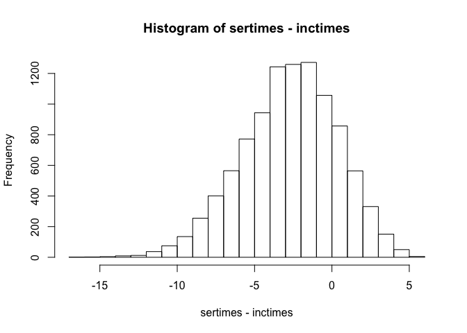

## Pre-symptomatic transmission 

The mean of (incubation time - serial interval) is the difference in means if the two are sampled independently. While this is a big assumption, we don't know the covariance. 

Mean differences in Tianjin: 7.11 - 4.22 = 2.89. 

Early:  7.01-4.22 = 2.79

Late: 12.4-4.22 = 8.18

Mean differences in Singapore:  7.11-4.56 = 2.55

Early: 5.71-4.56 = 1.15

Late: 7.86-4.56 = 3.3


Finally - let's sample the distribution of the time between symptom onset of a case to its infecting others (the distribution of  serial interval minus incubation time). The proportion of this duration that is negative gives the proportion of infections caused before symptom onset, which is per Fraser et al. PNAS 2004 one of the key factors that determines if an outbreak is controllable by non-pharmaceutical measures. Here we use either the conservative estimate of the incubation period 

We'll use estimates in the manuscript for all distributions. These are: serial interval mean 4.220 (sd .4) for Tianjin and mean 4.56 (sd 1.16), and for incubation period we have  Weibull distributions:

Tianjin 

* Early median 6.9 shape 2.73  (2.01, 3.43) scale 7.85 (6.85, 8.94)

* Late median 12.43 shape 3.95 (2.66, 4.97) scale 13.64 (11.99, 15.51)

* unstratified 8.62 shape 2.25 (1.79, 2.83) scale 10.15 (8.9, 11.6)) 

Singapore 

* Early median 5.46 shape 2.35 (1.5,3.0) scale 6.38 (5.14,7.43) 

* Late median 7.27 shape 1.93 (1.43,2.46) scale 8.79 (7.35,10.23)

* unstratified median 6.55 shape 1.88 (1.47,2.39 ) scale 7.97 (6.84,9.27)


```r
tianjin=list()
tianjin[[1]]=list(median=6.9, shape=2.73, minshape=2.01, maxshape=3.43, scale=7.85, minscale=6.85, maxscale=8.94)
tianjin[[2]]=list(median=12.43, shape=3.95, minshape=2.66, maxshape=4.97, scale=13.64, minscale=11.99, maxscale=15.51)
tianjin[[3]]=list(median= 8.62, shape= 2.25, minshape=1.79, maxshape=2.83, scale =10.15, minscale=8.9, maxscale=11.6)  # actually I won't need all of that information here 

singapore=list()
singapore[[1]]=list(median= 5.46, shape= 2.35, scale= 6.38)
singapore[[2]]=list(median= 7.27, shape= 1.93, scale= 8.79)
singapore[[3]]=list(median=6.55 , shape=1.88 , scale =7.97)
```

We will perform 6 experiments: Tianjin early, late, unstratified; Singapore early, late, unstratified.

## Tianjin 


```r
Nsamp=10000
inctimesE = rweibull(Nsamp, shape = tianjin[[1]]$shape, scale = tianjin[[1]]$scale)
inctimesL = rweibull(Nsamp, shape = tianjin[[2]]$shape, scale = tianjin[[2]]$scale)
inctimesU = rweibull(Nsamp, shape = tianjin[[3]]$shape, scale = tianjin[[3]]$scale)


sertimes= rnorm(Nsamp, mean = 4.22, sd = 0.40)

d1=data.frame(TimeDiff=sertimes-inctimesE, group="Early")
d2=data.frame(TimeDiff=sertimes-inctimesL, group="Late")
d3=data.frame(TimeDiff=sertimes-inctimesU, group="Unstratified")

df=rbind(d1,d2, d3) 

ggplot(data=df, aes(x=TimeDiff, fill=group))+geom_histogram(position="dodge")+theme_bw()+ggtitle("Tianjin")
```

```
## `stat_bin()` using `bins = 30`. Pick better value with `binwidth`.
```

<!-- -->

```r
ggsave(file="portion_pre_Tianjin.pdf", height=4,width = 6)
```

```
## `stat_bin()` using `bins = 30`. Pick better value with `binwidth`.
```

The portion of transmission that occurs pre-symptoms is estimated (very simply) by the fraction of (incubation - serial interval) that is negative. Note that this assumes independence of symptom onset and incubation time and so may be an overestimate. We report cautiously in the paper for this reason. 


```r
# portion pre-symptom: early
sum(d1$TimeDiff<0)/length(d1$TimeDiff)
```

```
## [1] 0.8241
```

```r
# portion pre-symptom: late
sum(d2$TimeDiff<0)/length(d2$TimeDiff)
```

```
## [1] 0.9906
```

```r
# portion pre-symptom: unstratified 
sum(d3$TimeDiff<0)/length(d3$TimeDiff)
```

```
## [1] 0.8663
```


## Singapore 


```r
Nsamp=10000
inctimesE = rweibull(Nsamp, shape = singapore[[1]]$shape, scale = singapore[[1]]$scale)
inctimesL = rweibull(Nsamp, shape = singapore[[2]]$shape, scale = singapore[[2]]$scale)
inctimesU = rweibull(Nsamp, shape = singapore[[3]]$shape, scale = singapore[[3]]$scale)


sertimes= rnorm(Nsamp, mean = 4.56, sd = 0.953)

d1=data.frame(TimeDiff=sertimes-inctimesE, group="Early")
d2=data.frame(TimeDiff=sertimes-inctimesL, group="Late")
d3=data.frame(TimeDiff=sertimes-inctimesU, group="Unstratified")

df=rbind(d1,d2, d3) 

ggplot(data=df, aes(x=TimeDiff, fill=group))+geom_histogram(position="dodge")+theme_bw()+ggtitle("Singapore")
```

```
## `stat_bin()` using `bins = 30`. Pick better value with `binwidth`.
```

<!-- -->

```r
ggsave(file="portion_pre_Singapore.pdf", height=4,width = 6)
```

```
## `stat_bin()` using `bins = 30`. Pick better value with `binwidth`.
```


The portion of transmission that occurs pre-symptoms is estimated (very simply) by the fraction of (incubation - serial interval) that is negative. Note that this assumes independence of symptom onset and incubation time and so may be an overestimate. We report cautiously in the paper for this reason. 


```r
# portion pre-symptom: early
sum(d1$TimeDiff<0)/length(d1$TimeDiff)
```

```
## [1] 0.6352
```

```r
# portion pre-symptom: late
sum(d2$TimeDiff<0)/length(d2$TimeDiff)
```

```
## [1] 0.7509
```

```r
# portion pre-symptom: unstratified
sum(d3$TimeDiff<0)/length(d3$TimeDiff)
```

```
## [1] 0.705
```


Now a broader experiment where we sample the shape and scale parameters from the above distribution, assuming they themselves are normal. 


```r
Nsamp=10000
shapes=rnorm(Nsamp, tianjin[[1]]$shape, (tianjin[[1]]$maxshape-tianjin[[1]]$shape)/1.96)
scales=rnorm(Nsamp, tianjin[[1]]$scale, (tianjin[[1]]$maxscale-tianjin[[1]]$scale)/1.96)
inctimes = rweibull(Nsamp, shape=shapes, scale=scales)
# tianjin mean 4.22 (3.15, 5.29) so sd of the means is 
serialmeansd=(4.22-3.15)/1.96
sermeans = rnorm(Nsamp, 4.22, serialmeansd)
sersd=1 # sd in the mean  ... ok 
sertimes= rnorm(Nsamp, mean =sermeans, sd=sersd)
hist(sertimes-inctimes,breaks = 30) 
```

<!-- -->

```r
sum(sertimes-inctimes < 0)/length(sertimes)
```

```
## [1] 0.8042
```

This is consistent with the other estimates. 
