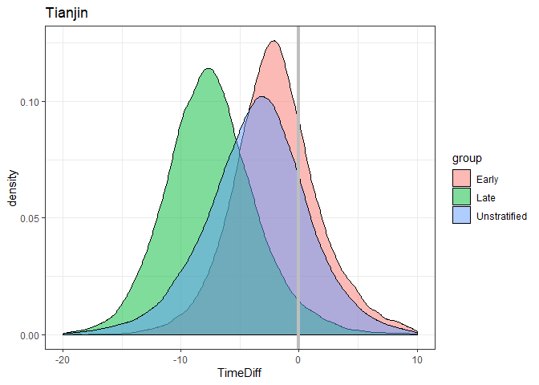
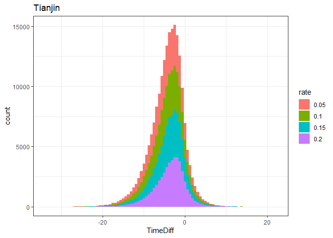
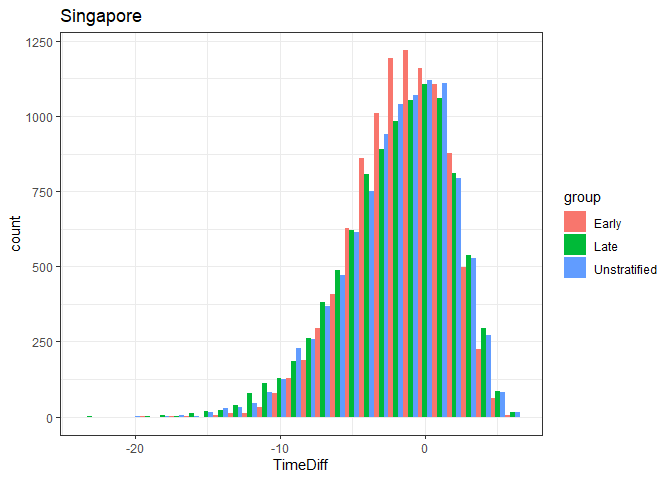
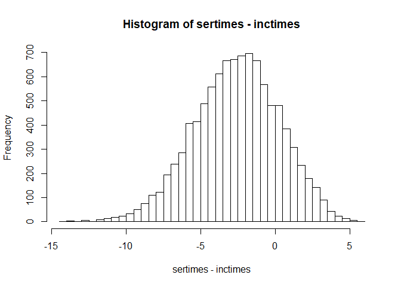
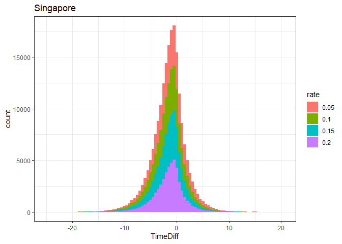
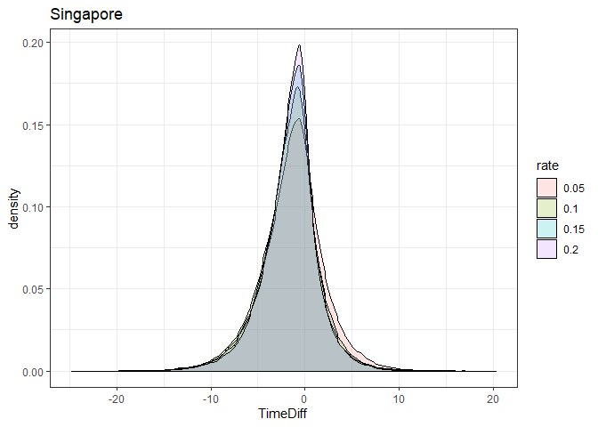
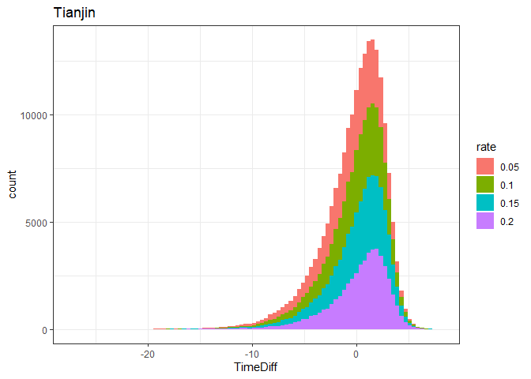
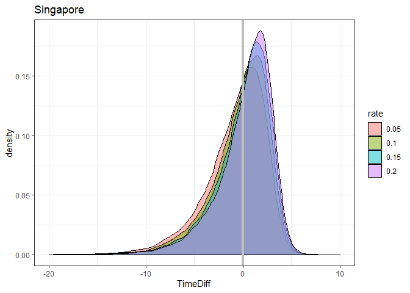

## Pre-symptomatic transmission 

The mean of (incubation time - serial interval) is the difference in means if the two are sampled independently. While this is a big assumption, we don't know the covariance. 

Mean differences in Tianjin: 8.89 - 4.31 = 4.58. 

Early:  6.83-4.31 = 2.52

Late: 12.5-4.31 = 8.19

Mean differences in Singapore:  6.18 - 4.17 = 2.01

Early: 5.92-4.17 = 1.75

Late: 6.30-4.17 = 2.13


Finally - let's sample the distribution of the time between symptom onset of a case to its infecting others (the distribution of  serial interval minus incubation time). The proportion of this duration that is negative gives the proportion of infections caused before symptom onset, which is per Fraser et al. PNAS 2004 one of the key factors that determines if an outbreak is controllable by non-pharmaceutical measures. Here we use either the conservative estimate of the incubation period 

We'll use estimates in the manuscript for all distributions. These are: serial interval mean 4.31 (sd 0.935) for Tianjin and mean 4.17 (sd 1.057) for Singapore, and for incubation period we have Weibull distributions:

Tianjin 

* Early median 6.73 shape 2.88  (2.16, 3.48) scale 7.643 (6.735, 8.553)

* Late median 12.6 shape 17.78 (9.52, 21.47) scale 0.695 (0.379,0.778)


Singapore (I will load these in, below, so as not to mistake numbers etc). 

* Early median 5.51 shape 2.05 (1.34,2.58) scale 6.587 (5.077,7.897) 

* Late median 5.67 shape 1.75 (1.29,2.21) scale 6.989 (5.048,8.38)


```r
tianjin=list()
tianjin[[1]]=list(median=6.73,shape=2.88,minshape=2.16, maxshape=3.48, scale=7.643, minscale=6.735, maxscale=8.553)
tianjin[[2]]=list(median=12.6,shape=4.34,minshape=3.1,maxshape=5.24,scale=13.661, minscale=12.245, maxscale=15.289)
tianjin[[3]]=list(median= 8.59, shape= 2.41, minshape=1.99, maxshape=2.9,scale =10.01,minscale=8.94, maxscale=11.2)  # actually I won't need all of that information here 

singapore=list()
singapore[[1]]=list(median= 5.51, shape= 2.05, scale= 6.587)
singapore[[2]]=list(median= 5.67, shape= 1.75, scale= 6.989)
singapore[[3]]=list(median=5.66 , shape=1.83 , scale =6.91)
```

We will perform 6 experiments: Tianjin early, late, unstratified; Singapore early, late, unstratified.

## Tianjin 


```r
Nsamp=10000
inctimesE = rweibull(Nsamp, shape = tianjin[[1]]$shape, scale = tianjin[[1]]$scale)
inctimesL = rweibull(Nsamp, shape = tianjin[[2]]$shape, scale = tianjin[[2]]$scale)
inctimesU = rweibull(Nsamp, shape = tianjin[[3]]$shape, scale = tianjin[[3]]$scale)


sertimes= rnorm(Nsamp, mean = 4.31 , sd = 0.935)

d1=data.frame(TimeDiff=sertimes-inctimesE, group="Early")
d2=data.frame(TimeDiff=sertimes-inctimesL, group="Late")
d3=data.frame(TimeDiff=sertimes-inctimesU, group="Unstratified")

df=rbind(d1,d2, d3) 

ggplot(data=df, aes(x=TimeDiff, fill=group))+geom_histogram(position="dodge")+theme_bw()+ggtitle("Tianjin")
```

```
## `stat_bin()` using `bins = 30`. Pick better value with `binwidth`.
```

<!-- -->

```r
ggsave(file="portion_pre_Tianjin.pdf", height=4,width = 6)
```

```
## `stat_bin()` using `bins = 30`. Pick better value with `binwidth`.
```

The portion of transmission that occurs pre-symptoms is estimated (very simply) by the fraction of (incubation - serial interval) that is negative. Note that this assumes independence of symptom onset and incubation time and so may be an overestimate. We report cautiously in the paper for this reason. 


```r
# portion pre-symptom: early
sum(d1$TimeDiff<0)/length(d1$TimeDiff)
```

```
## [1] 0.8102
```

```r
# portion pre-symptom: late
sum(d2$TimeDiff<0)/length(d2$TimeDiff)
```

```
## [1] 0.9911
```

```r
# portion pre-symptom: unstratified 
sum(d3$TimeDiff<0)/length(d3$TimeDiff)
```

```
## [1] 0.8712
```


## With covariance. 

In the file cov_tianjin_cc.Rmd we estimated the covariation between the incubation period and serial interval. Now we can sample these, using multivariate distributions, to see how having some dependence structure may alter the proportion. 

The estimate of correlation was 0.289 but there was some variation in this, of course. 

Here is the approach I take now. 

- sample incubation period parameters using the fits to data in the main text. These fits include a variance estimate between the shape and scale parameters, so I sample shape and scale together keeping that in mind . Create 100 samples. This is 100 incubation period shape, scale pairs. 

- we have a multivariate gamma sampler and a multivariate normal one but not one with a gamma on one margin and a normal on the other.

- therefore, we use a gamma distribution for the serial interval, with the same mean and variance as the normal we estimated with the ICC method. We obtain 100 serial interval gamma shape, scale pairs with mean and variance as they should be. 

- For each of these 100 distributions, sample *jointly* 500 incubation periods and serial intervals, with correlation of 0.3 (ish). 

- Now we have 100x 500 samples of incubation period and serial interval. Their difference, SI - inc period, should be the fraction pre-symptomatic. 

THIS IS DIRECT TO DIRECT TIANJIN. For this I need the mean and sd of the Tianjin raw SIs and these are mean 5, sd 3.3. So $ a \theta =5$ and $a \theta^2$ = 3.34^2. This means that $\theta = 3.34^2/5 =2.23$ and $a = 5/2.23 =2.24$.  

```r
load("tianjin_inc_fits.Rdata") 

getMyDiffs = function(statfit, cormean=0.29) {
  # choose shape and scale according to our fits 
  incparsamps = exp(mvtnorm::rmvnorm(n=100,
                          mean = statfit$coefficients,
                          sigma=statfit$var))
  # choose mean SI with a bit of uncertainty too, but not too much 
  sishapes = rnorm(100, mean=2.24, sd=0.25)
# we don't really even know the correlation between inc and si
  corvals = rnorm(100, mean=cormean, sd = 0.04)
# sample: 
  bigsamps = lapply(1:100, function(x) 
  lcmix::rmvgamma(n=500, shape=c(incparsamps[x,1], sishapes[x]), 
           rate=c(1/incparsamps[x,2], 1/2.23),
           corr = matrix(c(1, corvals[x], corvals[x], 1), nrow = 2)))
# glue together 
  bigsamps = do.call(rbind, bigsamps)
  return(data.frame(incs=bigsamps[,1], sis=bigsamps[,2],
                    diffs= bigsamps[,2] - bigsamps[,1]))
}


earlydiffs = getMyDiffs(Eallthree$myfit_gamma)
anydiffs=getMyDiffs(allthree$myfit_gamma)
latediffs= getMyDiffs(Lallthree$myfit_gamma)


d1=data.frame(TimeDiff=earlydiffs$diffs, group="Early")
d2=data.frame(TimeDiff=latediffs$diffs, group="Late")
d3=data.frame(TimeDiff=anydiffs$diffs, group="Unstratified")

df=rbind(d1,d2, d3) 


#ggplot(data=df, aes(x=TimeDiff, fill=group))+geom_histogram(position="dodge", bins=30)+theme_bw()+ggtitle("Tianjin")
p3=ggplot(data=df, aes(x=TimeDiff, fill=group))+
  geom_density(alpha=0.5)+theme_bw()+
  geom_vline(xintercept = 0, linetype="solid", 
                color = "grey", size=1.5)+
  xlim(c(-20,10))+ggtitle("Tianjin")

ggplot(data=df, aes(x=TimeDiff, fill=group))+
  geom_density(alpha=0.5)+theme_bw()+
  geom_vline(xintercept = 0, linetype="solid", 
                color = "grey", size=1.5)+
  xlim(c(-20,10))+ggtitle("Tianjin")
```

```
## Warning: Removed 619 rows containing non-finite values (stat_density).
```

<!-- -->


```r
#ggsave(file="portion_pre_Tianjin_corr.pdf", height=4,width = 6)
ggsave(file="portion_pre_Tianjin_dir_to_dir.pdf", height = 4, width = 6)
```

```
## Warning: Removed 619 rows containing non-finite values (stat_density).
```


```r
# portion pre-symptom: early
sum(d1$TimeDiff<0)/length(d1$TimeDiff)
```

```
## [1] 0.72812
```

```r
# portion pre-symptom: late
sum(d2$TimeDiff<0)/length(d2$TimeDiff)
```

```
## [1] 0.96122
```

```r
# portion pre-symptom: unstratified 
sum(d3$TimeDiff<0)/length(d3$TimeDiff)
```

```
## [1] 0.8111
```

It remains to look at the estimates from the intermediates: what would they say? there, we don't have the true fits, just a bunch of bootstraps, so we would need another function and a bit more code. 

## Tianjin, with estimates from intermediate analysis

```r
load("interbooty2_tianjin.Rdata") # bootstraps for 0.05, 0.1, 0.15, 2, incubation period means
b=2.2
quantile(boot1$isboots*b, p=c(0.025, 0.5, 0.975))
```

```
##     2.5%      50%    97.5% 
## 6.756771 7.542269 8.561210
```

```r
quantile(boot2$isboots*b, p=c(0.025, 0.5, 0.975))
```

```
##     2.5%      50%    97.5% 
## 6.020476 6.889326 8.008777
```

```r
quantile(boot3$isboots*b, p=c(0.025, 0.5, 0.975))
```

```
##     2.5%      50%    97.5% 
## 5.470802 6.298956 7.449435
```

```r
quantile(boot4$isboots*b, p=c(0.025, 0.5, 0.975))
```

```
##     2.5%      50%    97.5% 
## 5.096490 5.910056 7.172453
```


For this part, we have the generation time and incubation period. The fraction pre-symp is the fraction of generation time - incubation period that is negative.

Let's blindly assume the same kind of correlation we have from the direct estimates, but use the intermediates to explore how much pre-symp transmission there would be. We do the same as above, but now the scale is fixed at 2 and we sample multivariate gamma for the incubation period and generation time (instead of serial interval and incubation period). Now I can sample the gsboots and isboots for the shapes. eg boot1$gsboots: gamma shape for generation time; boot1$isboots is the inc period. THIS IS INDIRECT WITH IC AND GEN TIME


```r
getDiffsInter = function(myboot, cormean=0.289) {
  gamshape= sample(myboot$gsboots, 100)
  incshape=sample(myboot$isboots,100)
  corvals = rnorm(100, mean=cormean, sd = 0.04)
  bigsamps = lapply(1:100, function(x) 
  lcmix::rmvgamma(n=500, shape=c(gamshape[x], incshape[x]), 
           rate=c(1/2.2, 1/2.2),
           corr = matrix(c(1, corvals[x], corvals[x], 1), nrow = 2)))
  bigsamps = do.call(rbind, bigsamps)
  return(data.frame(gens=bigsamps[,1], incs=bigsamps[,2],
                    TimeDiff= bigsamps[,1] - bigsamps[,2], rate=myboot$rate[1])) 
}

dif1=getDiffsInter(boot1)
dif2=getDiffsInter(boot2)
dif3=getDiffsInter(boot3)
dif4=getDiffsInter(boot4)

diffd=rbind(dif1,dif2, dif3,dif4) 
diffd$rate=as.factor(diffd$rate)


ggplot(data=diffd, aes(x=TimeDiff, fill=rate))+geom_histogram(position="stack",
                                                           bins=90)+theme_bw()+ggtitle("Tianjin")
```

<!-- -->

```r
ggplot(data=diffd, aes(x=TimeDiff, fill=rate))+geom_density(alpha=0.2)+theme_bw()+ggtitle("Tianjin")
```

<!-- -->


```r
ggsave(file="portion_pre_Tianjin_inter_corr.pdf", height=4,width = 6)
```


```r
sum(dif1$TimeDiff < 0)/nrow(dif1)
```

```
## [1] 0.90766
```

```r
sum(dif2$TimeDiff < 0)/nrow(dif2)
```

```
## [1] 0.91894
```

```r
sum(dif3$TimeDiff < 0)/nrow(dif3)
```

```
## [1] 0.90162
```

```r
sum(dif4$TimeDiff < 0)/nrow(dif4)
```

```
## [1] 0.88544
```

## Intermediate inc periods and ICC serial intervals 

This is "indirect to indirect". 

Perhaps the most fair comparison is between the incubation periods with intermediates estimates and teh serial intervals with intermediates estimates. 

I will not do the early/late split because this is kind of implicit in the intermediates, with on average twice as many intermediates landing in IPs that are twice as long. Or at least, I won't do them right now.

However, the analysis  likely to lead to the smallest amount of intermediate transmission is this one, so let's do this one. 

Now compare the bootstrapped inc periods (gamma, shape is boot1[,2] , boot2, etc; scale is 2) to the estimated ICC SI (shape is 21.2, scale is 0.203, see cov_tianjin_cc.Rmd where it says: 
To get an approximately similar (same mean and variance) gamma distribution, I need the mean 4.31 to be $a \theta$  and the variance to be $a \theta^2$ where $a$ is the shape and $\theta$ is the scale. This gives two equations and two unknowns: $a \theta = 4.4$, $a\theta^2$ = variance is $\sigma^2 = 0.874. This gives $\theta = a\theta^2 / a\theta = 0.874/4.4 = 0.199$, and $a = 4.4/0.199 = 22.1$.)  

INDIRECT TO INDIRECT 


```r
load("interbooty2_tianjin.Rdata")
getDiffsInterICC = function(myboot, cormean=0.289, sishape=22.1, siscale=0.199) {
  gamshape= sample(myboot$isboots, 100)
  corvals = rnorm(100, mean=cormean, sd = 0.04)
  bigsamps = lapply(1:100, function(x) 
  lcmix::rmvgamma(n=500, shape=c(gamshape[x], sishape), 
           rate=c(1/2.2, 1/siscale),
           corr = matrix(c(1, corvals[x], corvals[x], 1), nrow = 2)))
  bigsamps = do.call(rbind, bigsamps)
  return(data.frame(incubs=bigsamps[,1], sis=bigsamps[,2],
                    TimeDiff= bigsamps[,2] - bigsamps[,1], rate=myboot$rate[1])) 
  # note now we need SI minus IP whereas in the comparison w gen time and ip we needed gen time minus IP. that's why some of these are 2nd col - 1st, others are the other way around
}

dif1=getDiffsInterICC(boot1)
dif2=getDiffsInterICC(boot2)
dif3=getDiffsInterICC(boot3)
dif4=getDiffsInterICC(boot4)

diffd=rbind(dif1,dif2, dif3,dif4) 
diffd$rate=as.factor(diffd$rate)

ggplot(data=diffd, aes(x=TimeDiff, fill=rate))+geom_histogram(position="stack",
  bins=90)+theme_bw()+ggtitle("Tianjin")
```

<!-- -->

```r
ggplot(data=diffd, aes(x=TimeDiff, fill=rate))+
  geom_density(alpha=0.2)+theme_bw()+ggtitle("Tianjin")
```

<!-- -->

```r
p4=ggplot(data=diffd, aes(x=TimeDiff, fill=rate))+
  geom_density(alpha=0.5)+theme_bw()+
  geom_vline(xintercept = 0, linetype="solid", 
                color = "grey", size=1.5)+
  xlim(c(-20,10))+
  ggtitle("Tianjin") # going to arrange into one plot, i think. p1,2: sing direct, ind; 3,4 tianjin dir, ind

# also plot and save 
ggplot(data=diffd, aes(x=TimeDiff, fill=rate))+
  geom_density(alpha=0.5)+theme_bw()+
  geom_vline(xintercept = 0, linetype="solid", 
                color = "grey", size=1.5)+
  xlim(c(-20,10))+
  ggtitle("Tianjin")
```

```
## Warning: Removed 227 rows containing non-finite values (stat_density).
```

<!-- -->


```r
sum(dif1$TimeDiff < 0)/nrow(dif1)
```

```
## [1] 0.78284
```

```r
sum(dif2$TimeDiff < 0)/nrow(dif2)
```

```
## [1] 0.72028
```

```r
sum(dif3$TimeDiff < 0)/nrow(dif3)
```

```
## [1] 0.6669
```

```r
sum(dif4$TimeDiff < 0)/nrow(dif4)
```

```
## [1] 0.6175
```

AND HERE  IT IS FINALLY DIFFERENT. 


```r
ggsave("portion_pre_Tianjin_ind_ind.pdf")
```

```
## Saving 7 x 5 in image
```

```
## Warning: Removed 227 rows containing non-finite values (stat_density).
```

## Singapore 


```r
Nsamp=10000
inctimesE = rweibull(Nsamp, shape = singapore[[1]]$shape, scale = singapore[[1]]$scale)
inctimesL = rweibull(Nsamp, shape = singapore[[2]]$shape, scale = singapore[[2]]$scale)
inctimesU = rweibull(Nsamp, shape = singapore[[3]]$shape, scale = singapore[[3]]$scale)


sertimes= rnorm(Nsamp, mean = 4.17, sd = 1.057) 

d1=data.frame(TimeDiff=sertimes-inctimesE, group="Early")
d2=data.frame(TimeDiff=sertimes-inctimesL, group="Late")
d3=data.frame(TimeDiff=sertimes-inctimesU, group="Unstratified")

df=rbind(d1,d2, d3) 

ggplot(data=df, aes(x=TimeDiff, fill=group))+geom_histogram(position="dodge")+theme_bw()+ggtitle("Singapore")
```

```
## `stat_bin()` using `bins = 30`. Pick better value with `binwidth`.
```

<!-- -->

```r
ggsave(file="portion_pre_Singapore.pdf", height=4,width = 6)
```

```
## `stat_bin()` using `bins = 30`. Pick better value with `binwidth`.
```


The portion of transmission that occurs pre-symptoms is estimated (very simply) by the fraction of (incubation - serial interval) that is negative. Note that this assumes independence of symptom onset and incubation time and so may be an overestimate. We report cautiously in the paper for this reason. 


```r
# portion pre-symptom: early
sum(d1$TimeDiff<0)/length(d1$TimeDiff)
```

```
## [1] 0.6775
```

```r
# portion pre-symptom: late
sum(d2$TimeDiff<0)/length(d2$TimeDiff)
```

```
## [1] 0.6604
```

```r
# portion pre-symptom: unstratified
sum(d3$TimeDiff<0)/length(d3$TimeDiff)
```

```
## [1] 0.6691
```


### leftover 

Now a broader experiment where we sample the shape and scale parameters from the above distribution, assuming they themselves are normal. 


```r
Nsamp=10000
shapes=rnorm(Nsamp, tianjin[[1]]$shape, (tianjin[[1]]$maxshape-tianjin[[1]]$shape)/1.96)
scales=rnorm(Nsamp, tianjin[[1]]$scale, (tianjin[[1]]$maxscale-tianjin[[1]]$scale)/1.96)
inctimes = rweibull(Nsamp, shape=shapes, scale=scales)
# tianjin mean 4.22 (3.15, 5.29) so sd of the means is 
serialmeansd=(4.22-3.15)/1.96
sermeans = rnorm(Nsamp, 4.22, serialmeansd)
sersd=1 # sd in the mean  ... ok 
sertimes= rnorm(Nsamp, mean =sermeans, sd=sersd)
hist(sertimes-inctimes,breaks = 30) 
```

<!-- -->

```r
sum(sertimes-inctimes < 0)/length(sertimes)
```

```
## [1] 0.8106
```

This is consistent with the other estimates. 


## Singapore: with covariance. 

In the file cov_sing_cc.Rmd we estimated the covariation between the incubation period and serial interval. Now we can sample these, using multivariate distributions, to see how having some dependence structure may alter the proportion. 

The estimate of correlation was 0.429 but there was some variation in this, of course. 

I take the same approach as above.  THIS IS NOW DIRECT TO DIRECT - replacing the old one because I am sick of adding more and sorting them out. 
HERE the SI is mean 4 with sd of about 3; it is variable. This matches the right trunction F not too badly and also matches the empirical mean and sd not too badly, I think. This gives theta = 1.5 and a = 4/1.5 = 2.68

NOTE BEFORE I had 21 and 0.203, in place of 2.68 and 1.5, in the code below. That was DIRECT TO INDIRECT which I do not want any more. 


```r
load("singapore_inc_fits.Rdata") 
library(lcmix)
```

```
## Loading required package: R.methodsS3
```

```
## R.methodsS3 v1.8.0 (2020-02-14 07:10:20 UTC) successfully loaded. See ?R.methodsS3 for help.
```

```
## Loading required package: matrixStats
```

```
## Loading required package: MASS
```

```
## Loading required package: nnls
```

```r
getMyDiffs = function(statfit, cormean=0.429) {
  # choose shape and scale according to our fits 
  incparsamps = exp(mvtnorm::rmvnorm(n=100,
                          mean = statfit$coefficients,
                          sigma=statfit$var))
  # choose mean SI with a bit of uncertainty too, but not too much 
  sishapes = rnorm(100, mean=2.67, sd=0.2)
# we don't really even know the correlation between inc and si
  corvals = rnorm(100, mean=cormean, sd = 0.04)
# sample: 
  bigsamps = lapply(1:100, function(x) 
  rmvgamma(n=500, shape=c(incparsamps[x,1], sishapes[x]), 
           rate=c(1/incparsamps[x,2], 1/1.5),
           corr = matrix(c(1, corvals[x], corvals[x], 1), nrow = 2)))
# glue together 
  bigsamps = do.call(rbind, bigsamps)
  return(data.frame(incs=bigsamps[,1], sis=bigsamps[,2],
                    diffs= bigsamps[,2] - bigsamps[,1]))
}


earlydiffs = getMyDiffs(Eallthree$myfit_gamma)
anydiffs=getMyDiffs(allthree$myfit_gamma)
latediffs= getMyDiffs(Lallthree$myfit_gamma)


d1=data.frame(TimeDiff=earlydiffs$diffs, group="Early")
d2=data.frame(TimeDiff=latediffs$diffs, group="Late")
d3=data.frame(TimeDiff=anydiffs$diffs, group="Unstratified")

df=rbind(d1,d2, d3) 


p1=ggplot(data=df, aes(x=TimeDiff, fill=group))+
  geom_density(alpha=0.5)+theme_bw()+
  geom_vline(xintercept = 0, linetype="solid", 
                color = "grey", size=1.5)+
  xlim(c(-20,10))+
  ggtitle("Singapore")

ggplot(data=df, aes(x=TimeDiff, fill=group))+
  geom_density(alpha=0.5)+theme_bw()+
  geom_vline(xintercept = 0, linetype="solid", 
                color = "grey", size=1.5)+
  xlim(c(-20,10))+
  ggtitle("Singapore")
```

```
## Warning: Removed 179 rows containing non-finite values (stat_density).
```

<!-- -->


```r
# this was portion_pre_Singapore_corr.pdf  but that was direct to indirect
ggsave(file="portion_pre_Sing_dir_to_dir.pdf", height=4,width = 6)
```


```r
# portion pre-symptom: early
d1=dplyr::filter(d1, !is.na(TimeDiff))
sum(d1$TimeDiff<0)/length(d1$TimeDiff)
```

```
## [1] 0.7157
```

```r
# portion pre-symptom: late
d2=dplyr::filter(d2, !is.na(TimeDiff))
sum(d2$TimeDiff<0)/length(d2$TimeDiff)
```

```
## [1] 0.7292
```

```r
# portion pre-symptom: unstratified 
d3=dplyr::filter(d3, !is.na(TimeDiff))
sum(d3$TimeDiff<0)/length(d3$TimeDiff)
```

```
## [1] 0.73782
```

It remains to look at the estimates from the intermediates: what would they say? there, we don't have the true fits, just a bunch of bootstraps, so we would need another function and a bit more code. 

## Singapore, with estimates from intermediate analysis

```r
load("interbooty2.Rdata") # bootstraps for 0.05, 0.1, 0.15, 2, incubation period means
b=2
quantile(boot1$isboots*b, p=c(0.025, 0.5, 0.975))
```

```
##     2.5%      50%    97.5% 
## 4.140700 4.680827 5.423466
```

```r
quantile(boot2$isboots*b, p=c(0.025, 0.5, 0.975))
```

```
##     2.5%      50%    97.5% 
## 3.839479 4.217617 5.006032
```

```r
quantile(boot3$isboots*b, p=c(0.025, 0.5, 0.975))
```

```
##     2.5%      50%    97.5% 
## 3.545912 3.925385 4.519083
```

```r
quantile(boot4$isboots*b, p=c(0.025, 0.5, 0.975))
```

```
##     2.5%      50%    97.5% 
## 3.347159 3.706753 4.276773
```


For this part, we have the generation time and incubation period. The fraction pre-symp is the fraction of generation time - incubation period that is negative.

Let's blindly assume the same kind of correlation we have from the direct estimates, but use the intermediates to explore how much pre-symp transmission there would be. We do the same as above, but now the scale is fixed at 2 and we sample multivariate gamma for the incubation period and generation time (instead of serial interval and incubation period). Now I can sample the gsboots and isboots for the shapes. eg boot1$gsboots: gamma shape for generation time; boot1$isboots is the inc period


```r
getDiffsInter = function(myboot, cormean=0.429) {
  gamshape= sample(myboot$gsboots, 100)
  incshape=sample(myboot$isboots,100)
  corvals = rnorm(100, mean=cormean, sd = 0.04)
  bigsamps = lapply(1:100, function(x) 
  rmvgamma(n=500, shape=c(gamshape[x], incshape[x]), 
           rate=c(1/2.1, 1/2.1),  # SCALE was 2.1 for singapore
           corr = matrix(c(1, corvals[x], corvals[x], 1), nrow = 2)))
  bigsamps = do.call(rbind, bigsamps)
  return(data.frame(gens=bigsamps[,1], incs=bigsamps[,2],
                    TimeDiff= bigsamps[,1] - bigsamps[,2], rate=myboot$rate[1])) 
}

dif1=getDiffsInter(boot1)
dif2=getDiffsInter(boot2)
dif3=getDiffsInter(boot3)
dif4=getDiffsInter(boot4)

diffd=rbind(dif1,dif2, dif3,dif4) 
diffd$rate=as.factor(diffd$rate)


ggplot(data=diffd, aes(x=TimeDiff, fill=rate))+geom_histogram(position="stack",
                                                           bins=90)+theme_bw()+ggtitle("Singapore")
```

<!-- -->

```r
ggplot(data=diffd, aes(x=TimeDiff, fill=rate))+geom_density(alpha=0.2)+theme_bw()+ggtitle("Singapore")
```

<!-- -->


```r
ggsave(file="portion_pre_Sing_inter_corr.pdf", height=4,width = 6)
```


```r
sum(dif1$TimeDiff < 0)/nrow(dif1)
```

```
## [1] 0.67662
```

```r
sum(dif2$TimeDiff < 0)/nrow(dif2)
```

```
## [1] 0.72374
```

```r
sum(dif3$TimeDiff < 0)/nrow(dif3)
```

```
## [1] 0.7465
```

```r
sum(dif4$TimeDiff < 0)/nrow(dif4)
```

```
## [1] 0.75132
```


## Intermediate inc periods with ICC serial intervals, singapore

THIS IS INDIRECT TO INDIRECT 

To get an approximately similar (same mean and variance) gamma distribution, I need the mean 4.17 to be $a \theta$  and the variance to be $a \theta^2$ where $a$ is the shape and $\theta$ is the scale. This gives two equations and two unknowns: $a \theta = 4.17$, $a\theta^2$ = variance is $\sigma^2 =(1.06)^2. THis gives $\theta = a\theta^2 / a\theta =1.12/4.17 = 0.269$, and $a = 4.17/0.269 = 15.5$. 


```r
load("interbooty2.Rdata")

getDiffsInterICC = function(myboot, cormean=0.289, sishape=15.5, siscale=0.269) {
  gamshape= sample(myboot$isboots, 100)
  corvals = rnorm(100, mean=cormean, sd = 0.04)
  bigsamps = lapply(1:100, function(x) 
  lcmix::rmvgamma(n=500, shape=c(gamshape[x], sishape), 
           rate=c(1/2.1, 1/siscale),
           corr = matrix(c(1, corvals[x], corvals[x], 1), nrow = 2)))
  bigsamps = do.call(rbind, bigsamps)
  return(data.frame(incubs=bigsamps[,1], sis=bigsamps[,2],
                    TimeDiff= bigsamps[,2] - bigsamps[,1], rate=myboot$rate[1])) 
}
dif1=getDiffsInterICC(boot1)
dif2=getDiffsInterICC(boot2)
dif3=getDiffsInterICC(boot3)
dif4=getDiffsInterICC(boot4)

diffd=rbind(dif1,dif2, dif3,dif4) 
diffd$rate=as.factor(diffd$rate)

ggplot(data=diffd, aes(x=TimeDiff, fill=rate))+geom_histogram(position="stack",
  bins=90)+theme_bw()+ggtitle("Tianjin")
```

<!-- -->

```r
p2=ggplot(data=diffd, aes(x=TimeDiff, fill=rate))+
  geom_density(alpha=0.5)+theme_bw()+
  geom_vline(xintercept = 0, linetype="solid", 
                color = "grey", size=1.5)+
  xlim(c(-20,10))+
  ggtitle("Singapore")

ggplot(data=diffd, aes(x=TimeDiff, fill=rate))+
  geom_density(alpha=0.5)+theme_bw()+
  geom_vline(xintercept = 0, linetype="solid", 
                color = "grey", size=1.5)+
  xlim(c(-20,10))+
  ggtitle("Singapore")
```

```
## Warning: Removed 26 rows containing non-finite values (stat_density).
```

<!-- -->

```r
ggsave(file="portion_pre_Sing_ind_to_ind.pdf", height=4,width = 6)
```

```
## Warning: Removed 26 rows containing non-finite values (stat_density).
```


```r
sum(dif1$TimeDiff < 0)/nrow(dif1)
```

```
## [1] 0.5154
```

```r
sum(dif2$TimeDiff < 0)/nrow(dif2)
```

```
## [1] 0.45726
```

```r
sum(dif3$TimeDiff < 0)/nrow(dif3)
```

```
## [1] 0.41502
```

```r
sum(dif4$TimeDiff < 0)/nrow(dif4)
```

```
## [1] 0.38394
```
In the plot below: top, bottom row are Singapore, Tianjin; each row has direct to direct (left), indirect to indirect (right). 


```r
grid.arrange(p1,p2,p3,p4, nrow=2)
```

```
## Warning: Removed 179 rows containing non-finite values (stat_density).
```

```
## Warning: Removed 26 rows containing non-finite values (stat_density).
```

```
## Warning: Removed 619 rows containing non-finite values (stat_density).
```

```
## Warning: Removed 227 rows containing non-finite values (stat_density).
```

<!-- -->

